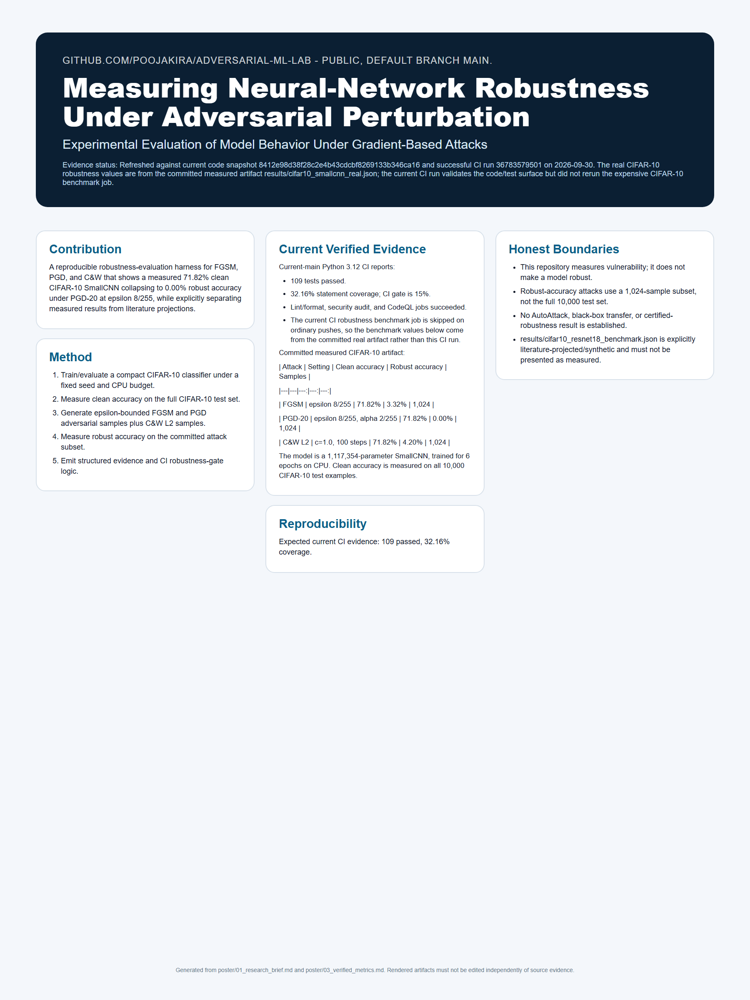

<!-- security-systems-poster -->
## Research Poster

**Security Systems / 06 — Measuring Neural-Network Robustness Under Adversarial Perturbation**

[](poster/poster_36x48.pdf)

> Technical research poster (36 x 48 in). Click the image for the print-resolution **[PDF](poster/poster_36x48.pdf)**.
> Poster measurements are dated snapshots at their printed commits. Use the repository evidence files for newer results; do not read the poster as a verification of the latest `main`.
> Every metric on it is evidence-backed; historical/projected numbers are labeled and separated from current results.
<!-- security-systems-poster -->

# adversarial-ml-lab

> Measure classifier robustness under gradient-based adversarial attacks (FGSM, PGD, C&W), gate it in CI, and map findings to MITRE ATLAS.

[](https://github.com/poojakira/adversarial-ml-lab/actions/workflows/ci.yml)
[](#testing)
[](LICENSE)

**Maintainer:** Pooja Kiran ([@poojakira](https://github.com/poojakira))

## Overview

`adversarial-ml-lab` is a measurement and admission harness that quantifies how much a CIFAR-10 classifier's accuracy degrades under adversarial perturbation. It implements three well-studied attacks (FGSM, PGD-L∞, C&W-L2) from their original papers, emits structured JSON reports tagged with MITRE ATLAS AML.T0043, and runs a robustness gate in CI so regressions are caught before merge. It is a measurement harness reproducing known attacks — not a research contribution and not a defense.

## Verified Snapshot

Reproduced on current `main` (Python 3.12, CPU). Real results are transcribed from committed `results/*.json`.

| Metric | Current verified result |
|---|---:|
| Tests | 109 passing, 0 skipped |
| Statement coverage | 32.16% (CI gate 15%); core attacks fgsm 71% / pgd 97% / cw 98% |
| Attacks | FGSM (L∞), PGD-20 (L∞), C&W (L2) |
| Committed CIFAR-10 result | 71.82% clean → 0.00% robust under PGD @ ε=8/255 (1024-sample subset) |
| CI robustness gate | PGD robust accuracy ≥ 30% @ ε=8/255 (HIGH/CRITICAL finding otherwise) |

## Security Problem

A model can report high clean-set accuracy yet collapse to near-zero under a perturbation smaller than the human eye can detect (ε=8/255). Most ML teams have no systematic way to measure that exposure. This lab turns published attacks into runnable benchmarks with a pass/fail CI threshold, so adversarial robustness is tested beside ordinary accuracy when the threat model includes crafted inputs.

## Threat Model & Scope

**In scope:** the strongest practical white-box threat model — full model access (weights, gradients), per-sample L∞ (FGSM/PGD, ε=8/255) or L2 (C&W) perturbations, MITRE ATLAS AML.T0043.

**Out of scope / not claimed:** No black-box/transfer/query attacks, no data poisoning, no physical-world perturbations, no AutoAttack. CIFAR-10 only; results do not transfer to other datasets/architectures without re-running. The committed real result uses a small CPU-budget CNN (~1.1M params, 6 epochs), **not** a SOTA ResNet — the ResNet numbers in `results/cifar10_resnet18_benchmark.json` are a labeled literature projection, not a measurement. The production runner's `cw_l2_proxy` is a PGD-100 proxy, not the full C&W optimizer.

## Architecture

```text
CIFAR-10 test images (torchvision)
      |
      v
Model (load or train small CNN)  -->  clean evaluation
      |
      v
Attack generation: FGSM (L∞) | PGD (L∞) | C&W (L2)
      |
      v
Robust evaluation (per attack, per epsilon)
      |
      v
MITRE ATLAS AML.T0043 enrichment  -->  JSON report  -->  CI gate (fail if PGD robust acc < threshold)
```

## Core Capabilities

- FGSM (L∞ one-step), PGD (L∞ iterative), C&W (L2 optimization) attack implementations
- Clean vs. robust accuracy measurement with per-epsilon sweeps
- Production admission mode: TorchScript model + NPZ evidence + SHA-256 provenance + operator-set PGD threshold
- CI robustness gate (PGD robust accuracy ≥ 30% @ ε=8/255) with HIGH/CRITICAL findings
- MITRE ATLAS AML.T0043 result enrichment; structured JSON reports
- Adversarial-training (Madry) reference script


## Motivation

This project answers a concrete question: how much does a model's accuracy degrade under adversarial conditions, and at what perturbation budget?

It implements three well-studied attacks (FGSM, PGD, and C&W) against CIFAR-10 classifiers, produces structured JSON benchmark reports, and can run in CI so that robustness regressions are caught before merge. The results are tagged with MITRE ATLAS metadata for teams who report adversarial risk in security frameworks.

This is not a research contribution. It is a measurement harness that reproduces known attacks from published papers.

## Why This Repository Exists

Most ML teams know adversarial examples are a problem but have no systematic way to measure their exposure. Papers describe attacks mathematically; this repo turns those descriptions into runnable benchmarks with pass/fail thresholds.

Questions this repo answers:

- What is the accuracy gap between clean evaluation and adversarial evaluation for my model?
- How does robustness change as I increase the perturbation budget (epsilon)?
- Does my latest training change make the model more or less robust under PGD?
- Can I gate my CI pipeline on a minimum adversarial accuracy threshold?
- How do FGSM (cheap, fast) and PGD (expensive, thorough) compare as robustness probes?
- What MITRE ATLAS technique does this attack surface map to, and how do I report it?

## Architecture Overview

```
┌─────────────────────────────────────────────────────────────────────────┐
│                         adversarial-ml-lab                               │
├─────────────────────────────────────────────────────────────────────────┤
│                                                                         │
│  ┌──────────────┐    ┌──────────────┐    ┌──────────────────────────┐  │
│  │  src/adv_lab │    │   attack_    │    │       benchmark/         │  │
│  │              │    │   mapping/   │    │  robustbench_baseline.py │  │
│  │  attacks/    │    │              │    └──────────────────────────┘  │
│  │  models/     │    │  enricher.py │                                  │
│  │  defenses/   │    │  reporter.py │    ┌──────────────────────────┐  │
│  │  eval/       │    └──────────────┘    │       dashboard/         │  │
│  └──────┬───────┘                        │       index.html         │  │
│         │                                └──────────────────────────┘  │
│         ▼                                                              │
│  ┌──────────────┐    ┌──────────────┐    ┌──────────────────────────┐  │
│  │   scripts/   │    │   results/   │    │        tests/            │  │
│  │              │───▶│  (JSON out)  │───▶│   pytest suite           │  │
│  │  run_cifar10 │    └──────────────┘    └──────────────────────────┘  │
│  │  _benchmark  │                                                      │
│  │  run_madry   │    ┌──────────────┐    ┌──────────────────────────┐  │
│  │  _training   │    │  .github/    │    │        docs/             │  │
│  └──────────────┘    │  workflows/  │    └──────────────────────────┘  │
│                      │  scripts/    │                                  │
│                      │  dependabot  │                                  │
│                      └──────────────┘                                  │
└─────────────────────────────────────────────────────────────────────────┘
```

**Component responsibilities:**

| Component | Role |
|-----------|------|
| `src/adv_lab/attacks/` | FGSM, PGD, and C&W attack implementations |
| `src/adv_lab/models/` | Target model definitions (ResNet architecture for CIFAR-10) |
| `src/adv_lab/defenses/` | Defense reference implementations and baselines |
| `src/adv_lab/eval/` | Benchmark runner, accuracy measurement, JSON reporting |
| `attack_mapping/` | MITRE ATLAS enrichment: tags results with AML.T0043 metadata |
| `benchmark/` | RobustBench baseline comparisons |
| `scripts/` | Entry-point scripts for full benchmark runs and adversarial training |
| `dashboard/` | Static HTML dashboard for visualizing results |
| `results/` | Output directory for benchmark JSON reports |
| `.github/workflows/` | CI pipeline: train, attack, validate threshold |
| `tests/` | pytest suite covering FGSM, PGD, C&W attacks, and eval harness |

## End-to-End Workflow

Here is how data moves through the system from start to finish:

```
1. CIFAR-10 test images (torchvision auto-download)
         │
         ▼
2. Model loading or training
   ├── Load pretrained ResNet weights, OR
   └── Train from scratch (scripts/run_madry_training.py)
         │
         ▼
3. Clean evaluation
   └── Measure baseline accuracy on unperturbed test set
         │
         ▼
4. Attack generation
   ├── FGSM: single gradient step, clipped to epsilon ball (L∞)
   ├── PGD: iterative projected gradient descent within epsilon ball (L∞)
   └── C&W: optimization-based, minimizes L2 perturbation
         │
         ▼
5. Robust evaluation
   └── Measure accuracy on adversarial examples per attack per epsilon
         │
         ▼
6. MITRE ATLAS enrichment (attack_mapping/)
   └── Tag each result with AML.T0043 metadata
         │
         ▼
7. JSON report emission
   └── Structured output with clean acc, robust acc, delta, params
         │
         ▼
8. CI gate check
   └── Fail if PGD robust accuracy < threshold (default: 30% at eps=8/255)
         │
         ▼
9. Dashboard visualization (optional)
   └── Serve results/report.json via dashboard/index.html
```

## Design Decisions and Trade-offs

**Why CIFAR-10 instead of ImageNet?**
CIFAR-10 trains in minutes on a single GPU. This makes the benchmark runnable in CI without dedicated infrastructure. The attacks generalize to larger datasets; CIFAR-10 is the proving ground, not the limit.

**Why train in CI instead of committing pretrained weights?**
Committing model weights bloats the repository and creates hidden dependencies on training code that might diverge. Training a small CNN in CI (not full ResNet) ensures the training path stays tested. Full ResNet benchmarks are for GPU runs outside CI.

**Why JSON output instead of a database?**
JSON is diffable, versionable in git, and parseable by any CI system. It keeps the tool self-contained without requiring infrastructure. Teams that need time-series tracking can ingest the JSON into their own systems.

**Why separate attack_mapping/ from the core library?**
The MITRE ATLAS enrichment is a reporting concern, not an ML concern. Keeping it separate means the core attack code has no dependency on threat framework taxonomies, and teams who do not use ATLAS can ignore it.

**Why L-infinity for FGSM/PGD and L2 for C&W?**
This follows the original papers. FGSM and PGD were designed around L-infinity perturbations. C&W was designed to minimize L2 distance. Mixing norms would make comparisons to published results meaningless.

**Why a CI threshold rather than just reporting?**
Without a gate, robustness metrics become informational noise. A hard threshold (PGD robust accuracy >= 30% at eps=8/255) turns the benchmark into a regression test with teeth.

## Tech Stack

| Layer | Technology |
|-------|-----------|
| Language | Python 3.10+ |
| ML Framework | PyTorch 2.0+ |
| Numerics | NumPy 1.24+ |
| Testing | pytest 8.2+, pytest-cov 5.0+ |
| Linting | Ruff 0.4+ (E, F, I, N, W, B, UP, S rules) |
| Security scanning | Bandit, pip-audit |
| Build | setuptools 68+, wheel |
| CI | GitHub Actions |
| Dependency management | `pyproject.toml` + pip/uv; Dependabot |
| Pre-commit | .pre-commit-config.yaml |

## Installation

### Prerequisites

- Python 3.10 or higher
- pip or uv
- GPU recommended for full ResNet benchmarks (CPU works for CI/testing)

### Standard install

```bash
git clone https://github.com/poojakira/adversarial-ml-lab.git
cd adversarial-ml-lab
pip install -e ".[dev]"      # Includes pytest, pytest-cov, ruff

# Optional ATT&CK integration (resolves the immutable Git-pinned attack-v19-core source)
pip install -e ".[attack]"
```

### Using Make

```bash
make install          # Install dependencies and package in editable mode
make install-core     # Install optional attack-v19-core dependency
make data             # Download attack data via external script
```

### Development setup

```bash
pip install -e ".[dev]"    # Includes pytest, pytest-cov, ruff
make lint                  # Run ruff checks
make format                # Auto-format code
make test                  # Run full test suite
make security              # Bandit + pip-audit
make verify                # lint + test + build + security (full check)
```

## Testing

```bash
pytest tests/ -q
make test       # Also installs the optional attack-v19-core sibling + downloads its data
make verify     # Full check: lint + test + build + security
```

### Current Coverage

The current head records **109 passing tests** and **32.16% overall line coverage** (verified in current-main CI; use the latest successful CI run
for the authoritative figure). The coverage profile is
dominated by ~20 advanced/experimental attack modules that are intentionally
lightly tested. The modules that matter for the core robustness story are
covered well:

| Module | Coverage |
|--------|---------:|
| `attacks/fgsm.py` (FGSM + shared input validation) | 71% |
| `attacks/pgd.py` (PGD L-inf + L2) | 97% |
| `attacks/cw.py` (C&W L2) | 98% |
| `eval/benchmark_runner.py` (runner + error paths) | 69% |
| `defenses/detection.py` | 99% |
| `defenses/adversarial_training.py` | 100% |

The CI gate floor is 15%.

**Tested modules:**
- `src/adv_lab/attacks/fgsm.py`  -  FGSM + input validation (`test_attacks.py`, `test_input_validation.py`)
- `src/adv_lab/attacks/pgd.py`  -  PGD L-inf/L2 + guards (`test_attacks.py`, `test_input_validation.py`)
- `src/adv_lab/attacks/cw.py`  -  C&W L2 + guards (`test_attacks.py`, `test_input_validation.py`)
- `src/adv_lab/eval/harness.py`  -  Benchmark harness, CI gate, JSON export (`test_eval.py`)
- `src/adv_lab/eval/benchmark_runner.py`  -  Benchmark runner, severity mapping, error paths (`test_eval.py`, `test_input_validation.py`)
- `src/adv_lab/defenses/adversarial_training.py`  -  AdversarialTrainer epoch & evaluation (`test_defenses.py`)
- `src/adv_lab/defenses/detection.py`  -  STRIPDetector, NeuralCleanse, bypass methods (`test_defenses.py`)
- `src/adv_lab/models/cifar10_resnet18.py`  -  ResNet-18 instantiation, forward pass, gradients (`test_models.py`)
- `benchmark/robustbench_baseline.py`  -  RobustBench comparison (`test_robustbench.py`)
- Epsilon constraint validation (`test_epsilon_constraints.py`)

**Lightly tested (advanced/experimental attack modules + eval utilities):**
- `attacks/`: adaptive, api_sim, blackbox, chaining, constrained, ensemble, evasion, inference, inversion, llm, model_stealing, non_classification, norms, param_search, physical, poisoning, universal
- `eval/`: certified, ci_signing, robustbench_loader, transferability
- `attack_mapping/`: enricher, reporter (requires external `attack_core` package)

Contributions to expand test coverage are welcome. See [CONTRIBUTING](CONTRIBUTING.md).

## Quick Start

```bash
# REAL small-CNN CIFAR-10 benchmark (CPU-only, a few minutes).
# Trains a compact CNN on real CIFAR-10 and runs the FGSM/PGD/C&W ladder.
# Writes results/cifar10_smallcnn_real.json with real, reproducible numbers.
python scripts/run_real_smallcnn_benchmark.py --epochs 6 --attack-samples 1000

# Deterministic smoke/demo only. This is NOT deployment evidence.
python -m adv_lab.eval.benchmark_runner --epsilon 0.031 --pgd-steps 40 --seed 42 --output report.json

# Production admission: explicit deployed TorchScript model + representative NPZ evidence.
python -m adv_lab.eval.benchmark_runner --production \
  --model-path artifacts/model.ts \
  --model-format torchscript \
  --dataset-path evidence/evaluation.npz \
  --epsilon 0.031 \
  --pgd-steps 40 \
  --min-pgd-robust-accuracy 0.30 \
  --output report.json

# Adversarial training (Madry et al. method)
python scripts/run_madry_training.py --epochs 100 --epsilon 0.031

# Full CIFAR-10 benchmark suite
python scripts/run_cifar10_benchmark.py
```

## Usage Examples

### Running in CI

```yaml
# .github/workflows/robustness.yml
- name: Robustness benchmark
  run: |
    pip install -e .
    python -m adv_lab.eval.benchmark_runner --production \
      --model-path artifacts/model.ts \
      --model-format torchscript \
      --dataset-path evidence/evaluation.npz \
      --epsilon 0.031 \
      --pgd-steps 20 \
      --min-pgd-robust-accuracy 0.30 \
      --output report.json
```

### Comparing against RobustBench baselines

```bash
python benchmark/robustbench_baseline.py
```

### Viewing results in the dashboard

```bash
make dashboard    # Serves dashboard/index.html on localhost:8080
```

## Threat Model and Mitigation Strategies

### Threat model

This benchmark assumes the strongest practical white-box threat model:

| Aspect | Assumption |
|--------|-----------|
| Attacker knowledge | Full model access (weights, architecture, gradients) |
| Attacker capability | Can craft per-sample perturbations within a norm budget |
| Perturbation constraint | L-infinity (eps=8/255 standard) or L2 (C&W) |
| Attack surface | MITRE ATLAS AML.T0043: Craft Adversarial Data |
| Goal | Cause misclassification while keeping perturbation imperceptible |

### What this does NOT model

- Black-box attacks (transfer-based or query-based)
- Data poisoning (training-time attacks)
- Model extraction or inversion
- Physical-world perturbations (patches, lighting changes)

### Mitigation strategies (reference, not implemented here)

| Defense | Approach | Expected robustness |
|---------|----------|-------------------|
| Adversarial training (Madry 2018) | Train on PGD examples | Literature-dependent; must be re-measured on the target model |
| Randomized smoothing (Cohen 2019) | Certifiable L2 robustness | Provable guarantees at cost of clean accuracy |
| Input preprocessing | JPEG compression, bit-depth reduction | Weak against adaptive attacks |
| Ensemble adversarial training | Train on adversarial examples from multiple models | Marginal gains over single-model AT |

The `scripts/run_madry_training.py` script provides a starting point for adversarial training as the primary recommended defense.

## Evaluation Methods, Results, and Limitations

### Methods

- **Clean accuracy**: Standard test-set accuracy with no perturbation
- **Robust accuracy**: Test-set accuracy when each sample is perturbed by the attack
- **Accuracy delta**: Clean accuracy minus robust accuracy (the vulnerability gap)
- **Per-epsilon sweep**: Evaluate at multiple epsilon values to characterize the degradation curve

### Real measured results (committed artifact)

The numbers below are **REAL and reproducible**. They come from an actual run
executed on CPU-only PyTorch and committed to
[`results/cifar10_smallcnn_real.json`](results/cifar10_smallcnn_real.json).
This is a **small CPU compute budget, NOT a state-of-the-art result** — a
compact CNN (~1.1M params) trained for 6 epochs on real CIFAR-10
(`torchvision.datasets.CIFAR10`, `download=True`).

| Attack | Epsilon | Clean Acc | Robust Acc | Samples |
|--------|---------|-----------|------------|---------|
| FGSM      | 8/255 | 71.82% | 3.32% | 1024 |
| PGD-20    | 8/255 | 71.82% | 0.00% | 1024 |
| C&W (L2)  | c=1.0 | 71.82% | 4.20% | 1024 |

- Clean accuracy is measured on the full 10,000-sample CIFAR-10 test set.
- Robust accuracy for the iterative/optimization attacks is measured on a 1024-sample
  subset (a compute-budget choice, labeled in the artifact).
- Seed = 42, `torch 2.14.0+cpu`, `cuda_available=false`. Wall clock ≈ 440 s.

Reproduce exactly:

```bash
python scripts/run_real_smallcnn_benchmark.py --epochs 6 --attack-samples 1000
```

**Interpretation:** an undefended model with 71.82% clean accuracy collapses to
near-0% under PGD at eps=8/255. This is the whole point — the clean/robust gap
is enormous for models that were not explicitly trained for robustness. The
absolute clean accuracy is low *only because the compute budget is small*; the
qualitative robustness collapse is the same one seen on larger models.

> **Literature context (NOT measured here):** For a fully-trained ResNet-18 at
> ~93% clean accuracy, published work (Madry et al. 2018) reports PGD robust
> accuracy near 0% undefended and ~45% after adversarial training. Those
> projected figures live in
> [`results/cifar10_resnet18_benchmark.json`](results/cifar10_resnet18_benchmark.json),
> which is explicitly labeled as a literature projection, not a measurement from
> this repo. Do not cite them as reproducible results of this repository.

### Limitations

- **Scope is measurement, not defense.** This repo quantifies vulnerability; it does not make your model robust.
- **CIFAR-10 only.** Results do not transfer directly to other datasets or architectures without re-running.
- **Known attacks only.** This implements published methods. A model that survives FGSM/PGD/C&W is not guaranteed robust against future attacks.
- **Default benchmark runner uses an illustrative dummy model.** `python -m adv_lab.eval.benchmark_runner` runs against a dummy model for plumbing/CI purposes only — its numbers are **illustrative only** and are not committed as artifacts. For real, committed numbers use `scripts/run_real_smallcnn_benchmark.py` (see [results/cifar10_smallcnn_real.json](results/cifar10_smallcnn_real.json)).
- **Real committed results use a small CPU-budget CNN, not a SOTA ResNet-18.** Full ResNet benchmarks at ~93% clean accuracy require GPU infrastructure outside this CPU environment; the ResNet numbers in [results/cifar10_resnet18_benchmark.json](results/cifar10_resnet18_benchmark.json) are a labeled literature projection, not a measurement.
- **No adaptive attack evaluation.** If you implement a defense, you must evaluate it against attacks that are aware of the defense (AutoAttack, etc.).
- **Determinism.** Random seeds affect PGD initialization; results may vary slightly across runs.

## Engineering Readiness Assessment

| Criterion | Status | Notes |
|-----------|--------|-------|
| CI pipeline | Yes | GitHub Actions: train, attack, validate |
| CI gate with threshold | Yes | PGD robust accuracy >= 30% at eps=8/255 |
| Test suite | Partial | 15% is the CI gate floor; overall coverage 32.16% (109 tests), with core attacks (fgsm 71%, pgd 97%, cw 98%), benchmark runner (69%), and defenses (99-100%) covered well. Advanced attack modules are lightly tested |
| Linting and formatting | Yes | Ruff with security rules (S) enabled |
| Security scanning | Yes | Bandit + pip-audit |
| Dependency pinning | Partial | Core libraries use bounded/ranged requirements; the GitHub-only `attack-v19-core` optional integration is pinned to an immutable commit |
| Pre-commit hooks | Yes | .pre-commit-config.yaml |
| Dependabot | Yes | Automated dependency updates |
| Documentation | Yes | README, RUNBOOK, SECURITY, CONTRIBUTING, CHANGELOG, docs/ |
| Structured output | Yes | JSON reports, parseable by downstream systems |
| Dashboard | Yes | Static HTML visualization |
| Package installable | Yes | `pip install -e .` via setuptools |

**What would still be required before production use:**
- No model registry integration (weights are ephemeral)
- No experiment tracking (no MLflow/W&B integration)
- No distributed evaluation support
- No GPU auto-detection or mixed-precision path in the benchmark runner
- No versioned result storage beyond git

## Roadmap and Future Improvements

1. **AutoAttack integration** - The current gold standard for robustness evaluation; would replace manual PGD/C&W sweeps for final reporting
2. **ImageNet support** - Extend beyond CIFAR-10 to production-scale datasets
3. **Adversarial training loop in core library** - Move `run_madry_training.py` into `src/adv_lab/defenses/` as a first-class feature
4. **Certified defenses** - Integrate randomized smoothing with certification radius reporting
5. **Black-box attacks** - Transfer attacks and query-based attacks (Square Attack, HopSkipJump)
6. **MLflow/W&B integration** - Track robustness metrics across training runs
7. **Multi-GPU evaluation** - Parallelize attack generation for large-scale benchmarks
8. **ONNX export testing** - Verify that robustness properties survive model export

## References

1. **MITRE ATLAS AML.T0043** - Craft Adversarial Data.
   https://atlas.mitre.org/techniques/AML.T0043

2. **Goodfellow, I. J., Shlens, J., & Szegedy, C. (2014).** Explaining and Harnessing Adversarial Examples.
   arXiv:1412.6572. https://arxiv.org/abs/1412.6572

3. **Madry, A., Makelov, A., Schmidt, L., Tsipras, D., & Vladu, A. (2018).** Towards Deep Learning Models Resistant to Adversarial Attacks.
   ICLR 2018. arXiv:1706.06083. https://arxiv.org/abs/1706.06083

4. **Carlini, N. & Wagner, D. (2017).** Towards Evaluating the Robustness of Neural Networks.
   IEEE S&P 2017. arXiv:1608.04644. https://arxiv.org/abs/1608.04644

5. **Cohen, J., Rosenfeld, E., & Kolter, J. Z. (2019).** Certified Adversarial Robustness via Randomized Smoothing.
   ICML 2019. arXiv:1902.02918. https://arxiv.org/abs/1902.02918

6. **Croce, F. & Hein, M. (2020).** Reliable evaluation of adversarial robustness with an ensemble of attacks (AutoAttack).
   ICML 2020. arXiv:2003.01690. https://arxiv.org/abs/2003.01690


## Additional Documentation

- [INCIDENT_RUNBOOK.md](INCIDENT_RUNBOOK.md) - incident response for robustness regressions and OOM

## License and Author

MIT License. See [LICENSE](LICENSE) for full text.

Author: [poojakira](https://github.com/poojakira)

Repository: https://github.com/poojakira/adversarial-ml-lab
Documentation site: https://poojakira.github.io/adversarial-ml-lab/

## Engineering Lessons

The main engineering lesson from this project is that clean-set accuracy and adversarial robustness measure different properties. For the models and attacks evaluated here, the gap is material, so robustness testing belongs beside ordinary accuracy evaluation when the threat model includes crafted inputs.

The second lesson is practical: making robustness evaluation a CI gate (not just a report) is what turns measurement into action. Teams respond to red builds. They do not respond to informational dashboards.

<!-- repo-verification:start -->
## Verification update — 2026-09-30

- **Scope:** Account-wide `poojakira` repository pass covering source/configuration, CI/release workflows, security-hygiene gates, dependency/SAST controls, and documentation consistency.
- **Remediation:** Ran the safe Ruff repair workflow, corrected the import/format gate, and pinned release/container/CodeQL/artifact actions to immutable revisions.
- **Verification state:** CI, Build and Security Gate, Security Hygiene, and Documentation Integrity completed successfully after the fixes; the evaluation-container workflow was still running at the audit snapshot.
- **Security note:** Robustness benchmarks remain evaluation evidence, not a claim of production robustness.
- **Evidence boundary:** This update records repository and GitHub Actions evidence observed during the pass. It is not a claim of independent penetration testing, production deployment, or zero residual risk.
<!-- repo-verification:end -->

## Verification checkpoint — 2026-09-30

- **Snapshot commit:** `95d9c097efc63ad4e8aed48cb85bc599a2de40cc`
- **Status:** PARTIALLY VERIFIED
- **Evidence:** Security Hygiene, Documentation Integrity, and Build and Security Gate passed. CI and the evaluation-container workflow were still running at the verification snapshot.
- This checkpoint is intentionally date-bounded. It does not claim zero vulnerabilities or universal production readiness.


## Secret handling

Keep runtime credentials outside Git. If this repository provides an `.env.example` or `.env.sample`, copy it to a local `.env` or `.env.local` and fill in values locally; the real environment file must remain untracked.

Do not commit AWS access keys or session credentials, API tokens, service-account JSON, private keys, package-manager credentials, Terraform state, or secret-bearing `tfvars`. CI/deployment credentials belong in GitHub Actions secrets or the deployment provider's secret manager. AWS account IDs are identifiers; AWS access-key IDs, secret access keys, and session tokens are credentials.

If a real credential is ever exposed, revoke or rotate it at the provider first, then remove it from the working tree and reachable Git history. The Security Hygiene workflow checks the current tree and reachable history for common credential formats without printing matched secret values.

## Security review

See [the dated security review](SECURITY_AUDIT_2026-09-30.md) for concrete fixes, verification and deployment limits.

Keep your own credentials in an ignored local `.env` or your deployment secret store. Copy placeholder values from `.env.example` only when that file exists, and supply API keys from your own provider accounts. Never commit actual keys or use test/example keys in a deployed service. Ignore rules do not remove secrets already committed; revoke exposed keys at the provider and review history separately.

<!-- security-local-config:start -->
## Secrets and local configuration

- Never commit real API keys, access tokens, passwords, cloud credentials, private keys, or a populated `.env` file.
- Local `.env` and `.env.*` files are ignored by Git. Only safe templates such as `.env.example` or `.env.sample` may be committed, and they must contain placeholder or empty values only.
- If an integration needs credentials, create your own local `.env` file (or use your shell/secret manager) and supply **your own** API key. In GitHub Actions, use repository/environment secrets rather than hard-coding values in workflow YAML.
- Do not copy or reuse any credential that appears in repository history, examples, tests, screenshots, logs, or documentation. Test strings are not intended to be usable credentials.
- If a real credential is ever committed, **revoke or rotate it at the credential provider first**, then remove it from the current tree and reachable Git history. Deleting a key from GitHub does not revoke it.
<!-- security-local-config:end -->
